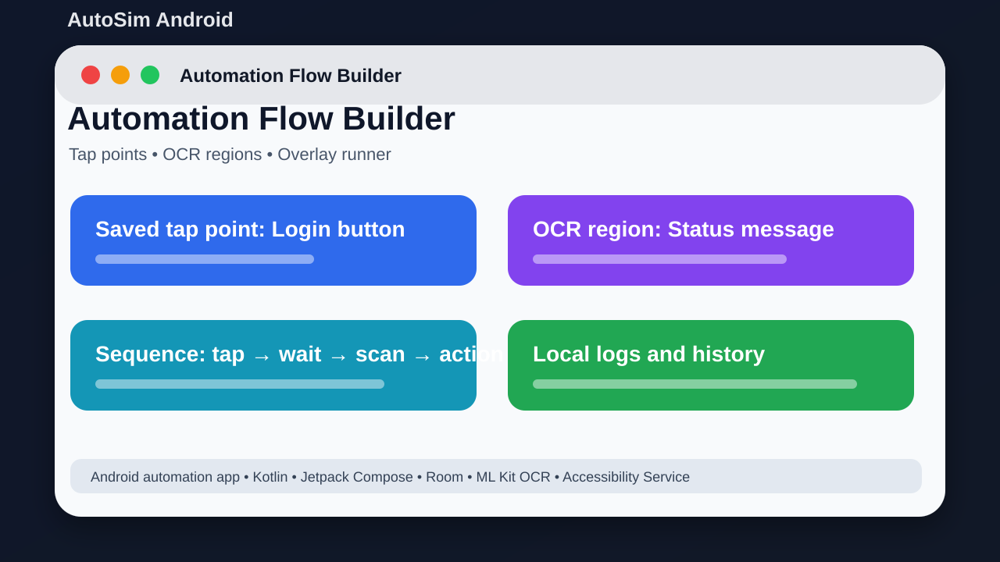

# AutoSim Android



## Short Description

Save tap points, read screen text, and run simple phone automation flows.

## About This Project

AutoSim Android is an Android automation project. It helps a user save screen positions, build repeatable actions, scan selected screen areas with OCR, and run actions when matching text is found.

The goal is to keep the project easy to understand, easy to run, and useful for learning or further development.

## Main Features

- Save tap positions and automation steps
- Create OCR regions for screen text checks
- Run tap, wait, and scan sequences
- Use floating overlay controls while testing
- Store automation data locally with Room
- Import/export saved automation data

## Tech Stack

- Kotlin
- Jetpack Compose
- Room
- ML Kit OCR
- Accessibility Service

## Project Location

Main local folder:

```text
D:\PROJECTS\AutoSimAndroid
```

GitHub repository:

https://github.com/saifalian/AutoSimAndroid

## Project Structure

```text
app/src/main/          Android app source
app/src/main/java/     Kotlin source files
gradle/                Gradle wrapper files
README.md              Project documentation
```

## How To Run

1. Open the project in Android Studio.
2. Let Gradle sync finish.
3. Build with gradle assembleDebug, or use Android Studio Run.
4. Install on an Android device or emulator.
5. Enable Accessibility, overlay, and screen capture permissions only when needed.

## Screenshot

The image above is a clean project preview for GitHub. It shows the main idea of the project in a simple way.

## Build Check

Build note: this repository does not currently include a Gradle wrapper script. Open it in Android Studio, or install/use a compatible Gradle version from your Android Studio setup.

## Current Status

This project is uploaded to GitHub and prepared as a portfolio-style repository. More improvements can be added later, such as real app screenshots, demo videos, releases, and issue templates.

## Safety Note

Use this only for user-controlled automation. Check every click point before running it on important apps.

## License

No license file is included yet. Add a license before using this project as an open-source project.
